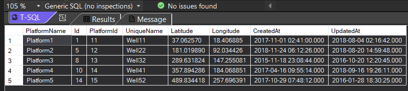

# PART 2: TECHNICAL ASSESSMENT (SQL QUERY)

### Question

>Based on the table platform and table well you already have on first exercise. Please write SQL Query that would return last updated well for each platform.

---

### Answer

We use windows function to achieve the result:


```sql
WITH CTE as 
(
select
p.UniqueName as PlatformName,
w.Id,
w.PlatformId,
w.UniqueName,
w.Latitude,
w.Longitude,
CONVERT(datetime, w.CreatedAt) AS CreatedAt,
CONVERT(datetime, w.UpdatedAt) AS UpdatedAt,
ROW_NUMBER() over (partition by p.UniqueName order by w.UpdatedAt Desc) as RowNum
from dbo.Platforms p
inner join dbo.Wells w ON p.Id = w.PlatformId
)

select
PlatformName,
Id,
PlatformId,
UniqueName,
Latitude,
Longitude,
CreatedAt,
UpdatedAt

from CTE where RowNum = 1 
```

### Query Result

